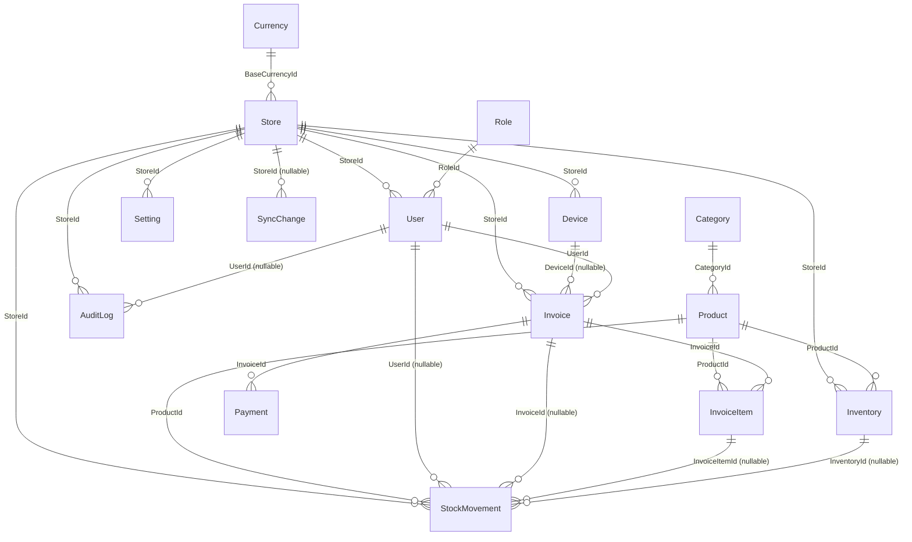

# Database Schema Report

Source of truth: EF Core 8 (Code-First) — entities in `src/POS.Core/Entities/`, configured via
`IEntityTypeConfiguration<T>` classes in `src/POS.Infrastructure/Data/Configurations/`, applied by
`PosDbContext` (`src/POS.Infrastructure/Data/PosDbContext.cs`). Migrations live in
`src/POS.Infrastructure/Data/Migrations/`.

All primary keys are `Guid` (`uniqueidentifier`) unless noted otherwise. All tables use soft-delete
(`IsDeleted bool`) — there is no global EF query filter configured, so callers are responsible for
filtering deleted rows. Every table also carries `CreatedAt` / `UpdatedAt` (`datetime2`) audit columns
unless noted otherwise.

## Entity-Relationship Overview

## Table of Contents

1. [Currencies](#1-currencies)
2. [Stores](#2-stores)
3. [Devices](#3-devices)
4. [Roles](#4-roles)
5. [Users](#5-users)
6. [Categories](#6-categories)
7. [Products](#7-products)
8. [Inventories](#8-inventories)
9. [Invoices](#9-invoices)
10. [InvoiceItems](#10-invoiceitems)
11. [Payments](#11-payments)
12. [StockMovements](#12-stockmovements)
13. [Settings](#13-settings)
14. [AuditLogs](#14-auditlogs)
15. [SyncChanges](#15-syncchanges)

---

### 1. Currencies

Reference table for supported currencies and their exchange rate vs. a store's base currency.

| Column | Type | Constraints |
|---|---|---|
| Id | uniqueidentifier | **PK** |
| Code | nvarchar(10) | Required |
| Name | nvarchar(200) | Required |
| Symbol | nvarchar(10) | Nullable |
| ExchangeRate | decimal(18,6) | Default `1` |
| CreatedAt | datetime2 | |
| UpdatedAt | datetime2 | |
| IsDeleted | bit | |

**Indexes:** `IX_Currencies_Code` (unique)
**Relations:** referenced by `Stores.BaseCurrencyId`

---

### 2. Stores

| Column | Type | Constraints |
|---|---|---|
| Id | uniqueidentifier | **PK** |
| Name | nvarchar(500) | Required |
| Address | nvarchar(1000) | Nullable |
| Phone | nvarchar(50) | Nullable |
| BaseCurrencyId | uniqueidentifier | **FK** → Currencies.Id (Restrict) |
| CreatedAt | datetime2 | |
| UpdatedAt | datetime2 | |
| IsDeleted | bit | |

**Relations:**
- `BaseCurrencyId` → `Currencies.Id` (many Stores : 1 Currency, `ON DELETE RESTRICT`)
- Referenced by: Devices, Users, Inventories, StockMovements, Invoices, Settings, AuditLogs, SyncChanges

---

### 3. Devices

Physical POS terminals/registers belonging to a store.

| Column | Type | Constraints |
|---|---|---|
| Id | uniqueidentifier | **PK** |
| StoreId | uniqueidentifier | **FK** → Stores.Id (Restrict) |
| Name | nvarchar(200) | Required |
| CreatedAt | datetime2 | |
| UpdatedAt | datetime2 | |
| SyncVersion | int | Default `1` |
| IsDeleted | bit | |

**Indexes:** `IX_Devices_StoreId_Name` (unique — device name unique per store)
**Relations:**
- `StoreId` → `Stores.Id` (Restrict)
- Referenced by: `Invoices.DeviceId` (nullable)

---

### 4. Roles

| Column | Type | Constraints |
|---|---|---|
| Id | uniqueidentifier | **PK** |
| Name | nvarchar(100) | Required |
| CreatedAt | datetime2 | |
| UpdatedAt | datetime2 | |
| IsDeleted | bit | |

**Indexes:** `IX_Roles_Name` (unique)
**Relations:** referenced by `Users.RoleId`

---

### 5. Users

| Column | Type | Constraints |
|---|---|---|
| Id | uniqueidentifier | **PK** |
| Username | nvarchar(100) | Required |
| PasswordHash | nvarchar(500) | Required |
| RoleId | uniqueidentifier | **FK** → Roles.Id (Restrict) |
| StoreId | uniqueidentifier | **FK** → Stores.Id (Restrict) |
| IsActive | bit | Default `true` |
| CreatedAt | datetime2 | |
| UpdatedAt | datetime2 | |
| IsDeleted | bit | |

**Indexes:** `IX_Users_Username` (unique)
**Relations:**
- `RoleId` → `Roles.Id` (Restrict)
- `StoreId` → `Stores.Id` (Restrict)
- Referenced by: `Invoices.UserId`, `AuditLogs.UserId` (nullable), `StockMovements.UserId` (nullable)

---

### 6. Categories

| Column | Type | Constraints |
|---|---|---|
| Id | uniqueidentifier | **PK** |
| Name | nvarchar(200) | Required |
| CreatedAt | datetime2 | |
| UpdatedAt | datetime2 | |
| IsDeleted | bit | |

**Indexes:** `IX_Categories_Name` (non-unique)
**Relations:** referenced by `Products.CategoryId`

---

### 7. Products

| Column | Type | Constraints |
|---|---|---|
| Id | uniqueidentifier | **PK** |
| Name | nvarchar(500) | Required |
| Barcode | nvarchar(100) | Nullable |
| Price | decimal(18,2) | |
| Cost | decimal(18,2) | |
| CategoryId | uniqueidentifier | **FK** → Categories.Id (Restrict) |
| IsWeighted | bit | |
| IsActive | bit | Default `true` |
| ImagePath | nvarchar(1000) | Nullable |
| CreatedAt | datetime2 | |
| UpdatedAt | datetime2 | |
| IsDeleted | bit | |

**Indexes:** `IX_Products_Barcode` (non-unique)
**Relations:**
- `CategoryId` → `Categories.Id` (Restrict)
- Referenced by: `Inventories.ProductId`, `InvoiceItems.ProductId`, `StockMovements.ProductId`

---

### 8. Inventories

Per-store stock level of a product (one row per Product+Store pair).

| Column | Type | Constraints |
|---|---|---|
| Id | uniqueidentifier | **PK** |
| ProductId | uniqueidentifier | **FK** → Products.Id (Cascade) |
| StoreId | uniqueidentifier | **FK** → Stores.Id (Cascade) |
| Quantity | decimal(18,4) | |
| CreatedAt | datetime2 | |
| UpdatedAt | datetime2 | |
| IsDeleted | bit | |

**Indexes:** `IX_Inventories_ProductId_StoreId` (unique)
**Relations:**
- `ProductId` → `Products.Id` (Cascade — deleting a product deletes its inventory rows)
- `StoreId` → `Stores.Id` (Cascade)
- Referenced by: `StockMovements.InventoryId` (nullable)

---

### 9. Invoices

Sales transactions (a.k.a. orders/receipts).

| Column | Type | Constraints |
|---|---|---|
| Id | uniqueidentifier | **PK** |
| StoreId | uniqueidentifier | **FK** → Stores.Id (Restrict) |
| DeviceId | uniqueidentifier | **FK** → Devices.Id (Restrict), Nullable |
| UserId | uniqueidentifier | **FK** → Users.Id (Restrict) |
| CustomerId | uniqueidentifier | Nullable (no FK / no Customer table yet) |
| Status | int (enum `InvoiceStatus`) | `Open=0, Paid=1, Cancelled=2, Held=3` |
| TotalAmount | decimal(18,2) | |
| TaxPercent | decimal(5,2) | Invoice-level tax %, applied to after-discount subtotal |
| Currency | nvarchar(10) | Required, default `"USD"` |
| Notes | nvarchar(2000) | Nullable |
| IsSynced | bit | Default `false` |
| SyncVersion | int | Default `1` |
| CreatedAt | datetime2 | |
| UpdatedAt | datetime2 | |
| IsDeleted | bit | |

**Indexes:** `IX_Invoices_StoreId_Status`, `IX_Invoices_StoreId_IsSynced`
**Relations:**
- `StoreId` → `Stores.Id` (Restrict)
- `DeviceId` → `Devices.Id` (Restrict, nullable)
- `UserId` → `Users.Id` (Restrict)
- Referenced by: `InvoiceItems.InvoiceId` (Cascade), `Payments.InvoiceId` (Cascade), `StockMovements.InvoiceId` (nullable)

**Note:** `CustomerId` has no navigation/FK — there is currently no `Customers` table in the model.

---

### 10. InvoiceItems

Line items belonging to an invoice.

| Column | Type | Constraints |
|---|---|---|
| Id | uniqueidentifier | **PK** |
| InvoiceId | uniqueidentifier | **FK** → Invoices.Id (Cascade) |
| ProductId | uniqueidentifier | **FK** → Products.Id (Restrict) |
| Quantity | decimal(18,4) | |
| UnitPrice | decimal(18,2) | |
| DiscountPercent | decimal(5,2) | Per-line discount %, applied before tax |
| LineTotal | decimal(18,2) | |
| CreatedAt | datetime2 | |
| UpdatedAt | datetime2 | |
| IsDeleted | bit | |

**Relations:**
- `InvoiceId` → `Invoices.Id` (Cascade — deleting an invoice deletes its items)
- `ProductId` → `Products.Id` (Restrict — a product can't be hard-deleted while referenced by an item)
- Referenced by: `StockMovements.InvoiceItemId` (nullable)

---

### 11. Payments

Payments applied to an invoice (an invoice can have multiple partial payments).

| Column | Type | Constraints |
|---|---|---|
| Id | uniqueidentifier | **PK** |
| InvoiceId | uniqueidentifier | **FK** → Invoices.Id (Cascade) |
| Amount | decimal(18,2) | |
| Method | int (enum `PaymentMethod`) | `Cash=0, Card=1, Other=2` |
| PaidAt | datetime2 | |
| CreatedAt | datetime2 | |
| UpdatedAt | datetime2 | |
| IsDeleted | bit | |

**Relations:** `InvoiceId` → `Invoices.Id` (Cascade)

---

### 12. StockMovements

Append-only ledger of every stock change (opening stock, manual adjustment, sale, refund).

| Column | Type | Constraints |
|---|---|---|
| Id | uniqueidentifier | **PK** |
| ProductId | uniqueidentifier | **FK** → Products.Id (Restrict) |
| StoreId | uniqueidentifier | **FK** → Stores.Id (Restrict) |
| InventoryId | uniqueidentifier | **FK** → Inventories.Id (Restrict), Nullable |
| InvoiceId | uniqueidentifier | **FK** → Invoices.Id (Restrict), Nullable |
| InvoiceItemId | uniqueidentifier | **FK** → InvoiceItems.Id (Restrict), Nullable |
| UserId | uniqueidentifier | **FK** → Users.Id (Restrict), Nullable |
| Type | int (enum `StockMovementType`) | `OpeningStock=1, ManualSetAdjustment=2, Sale=3, Refund=4` |
| QuantityDelta | decimal(18,4) | Signed change |
| QuantityAfter | decimal(18,4) | Resulting balance |
| Reference | nvarchar(100) | Nullable |
| Notes | nvarchar(500) | Nullable |
| CreatedAt | datetime2 | |
| UpdatedAt | datetime2 | |
| IsDeleted | bit | |

**Indexes:** `IX_StockMovements_StoreId_ProductId_CreatedAt`, `IX_StockMovements_InvoiceId`
**Relations:** all FKs use `ON DELETE RESTRICT` (ledger rows are never cascade-deleted)

---

### 13. Settings

Key/value store for per-store configuration.

| Column | Type | Constraints |
|---|---|---|
| Id | uniqueidentifier | **PK** |
| StoreId | uniqueidentifier | **FK** → Stores.Id (Cascade) |
| Key | nvarchar(100) | Required |
| Value | nvarchar(4000) | Required |
| CreatedAt | datetime2 | |
| UpdatedAt | datetime2 | |
| IsDeleted | bit | |

**Indexes:** `IX_Settings_StoreId_Key` (unique)
**Relations:** `StoreId` → `Stores.Id` (Cascade)

---

### 14. AuditLogs

Records of user/system actions for traceability.

| Column | Type | Constraints |
|---|---|---|
| Id | uniqueidentifier | **PK** |
| StoreId | uniqueidentifier | **FK** → Stores.Id (Restrict) |
| UserId | uniqueidentifier | **FK** → Users.Id (Restrict), Nullable |
| Action | nvarchar(100) | Required |
| EntityName | nvarchar(100) | Required |
| EntityId | uniqueidentifier | Nullable (no FK — polymorphic target) |
| Details | nvarchar(4000) | Nullable |
| CreatedAt | datetime2 | |
| UpdatedAt | datetime2 | |
| IsDeleted | bit | |

**Indexes:** `IX_AuditLogs_StoreId_CreatedAt`, `IX_AuditLogs_StoreId_Action_EntityName_CreatedAt`
**Relations:** `StoreId` → `Stores.Id` (Restrict); `UserId` → `Users.Id` (Restrict, nullable)

---

### 15. SyncChanges

Append-only changefeed for offline/multi-device sync. Populated automatically by `PosDbContext.SaveChanges`
whenever a tracked entity of a syncable type (`AuditLog`, `Category`, `Currency`, `Device`, `Invoice`,
`Product`, `User`, `Setting`, `Store.BaseCurrencyId`) is added or modified.

| Column | Type | Constraints |
|---|---|---|
| Id | **bigint** (identity) | **PK**, auto-increment (global sequence, used as sync cursor) |
| StoreId | uniqueidentifier | **FK** → Stores.Id (Restrict), Nullable (null = global/store-independent change, e.g. Product or CurrencyPolicy) |
| AggregateType | nvarchar(100) | Required — one of `SyncAggregateTypes` constants: `AuditLog`, `Category`, `CurrencyPolicy`, `Device`, `Invoice`, `Product`, `User`, `Setting` |
| EntityId | uniqueidentifier | Nullable — id of the changed row (null for key-addressed aggregates like Setting) |
| EntityKey | nvarchar(200) | Nullable — used instead of EntityId for `Setting` (the setting Key) |
| ChangedAt | datetime2 | |

**Indexes:** `IX_SyncChanges_AggregateType_Id`, `IX_SyncChanges_StoreId_AggregateType_Id`
**Relations:** `StoreId` → `Stores.Id` (Restrict, nullable)
**Note:** No `CreatedAt`/`UpdatedAt`/`IsDeleted` columns — this table is a pure append-only log.

---

## Summary of Delete Behaviors

| Cascade (`ON DELETE CASCADE`) | Restrict (`ON DELETE RESTRICT`, default for most FKs) |
|---|---|
| Inventories → Products, Stores | Users → Roles, Stores |
| InvoiceItems → Invoices | Products → Categories |
| Payments → Invoices | Invoices → Stores, Devices, Users |
| Settings → Stores | InvoiceItems → Products |
| | StockMovements → Products, Stores, Inventories, Invoices, InvoiceItems, Users (all) |
| | AuditLogs → Stores, Users |
| | SyncChanges → Stores |
| | Devices → Stores |
| | Stores → Currencies |

## Notable Modeling Gaps

- **No `Customers` table**: `Invoices.CustomerId` is an unmapped `Guid?` with no FK/navigation.
- **No global soft-delete filter**: `IsDeleted` is present on nearly every table but not enforced via
  `HasQueryFilter` in `OnModelCreating` — application code must filter it explicitly.
- **Enums stored as `int`**: `InvoiceStatus`, `PaymentMethod`, `StockMovementType` are persisted as plain
  integers (via `.HasConversion<int>()` for Invoice/Payment; StockMovement's `Type` uses the default int
  conversion), not as strings — see `src/POS.Core/Enums/` for the mappings.

## Migration History

| Migration | Purpose |
|---|---|
| `20260327174106_InitialCreate` | Base schema |
| `20260328120000_Stage1MvpEntities` | Stage 1 MVP entities |
| `20260329000000_AddProductImagePath` | Added `Products.ImagePath` |
| `20260329120000_AddDiscountAndTax` | Added discount/tax fields to InvoiceItems/Invoices |
| `20260402120000_AddCurrenciesAndStorePolicy` | Added `Currencies` table + `Stores.BaseCurrencyId` |
| `20260418165231_AddStockMovementsLedger` | Added `StockMovements` table |
| `20260518154739_AddStoreSettings` | Added `Settings` table |
| `20260518161508_AddAuditLogs` | Added `AuditLogs` table |
| `20260518193542_AddDeviceSyncMetadata` | Added `Devices.SyncVersion`, sync metadata |
| `20260520083804_AddGlobalSyncChangeSequence` | Added `SyncChanges` table |
